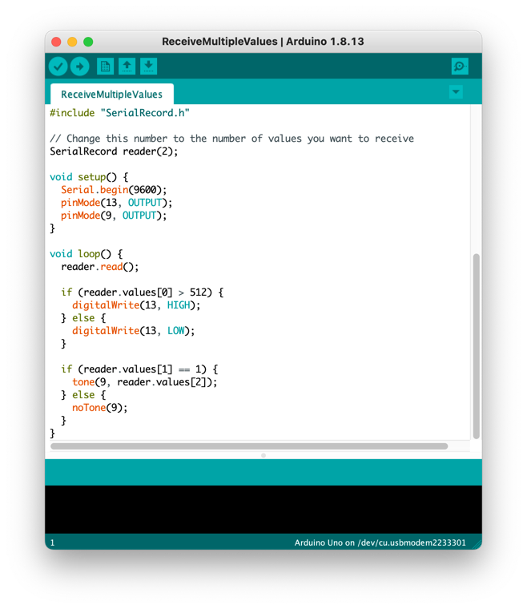

# Serial Record Library for Arduino

Library to send and read single or multiple values to and from the serial port.

The library transmits the values in ASCII. Each record is a sequence of ASCII
representations of numbers, separated by a comma and terminated by a newline.
This is the format used by the Arduino IDE Serial Plotter tool.

This library can be used in conjunction with the [Processing SerialRecord]
library for [Processing](https://processing.org), but does not require it.



[Processing SerialRecord]: https://osteele.github.io/Processing_SerialRecord/

## Design Goals

- Easy for novice programmers to configure and use
- Easy to inspect the transmitted data
- Detects and provides diagnostics for common errors

### Non-goals

- Efficiency. The library uses an ASCII representation of numbers. This is easy
  to visually inspect without tools, but it is computationally expensive to read
  and write, and requires more bandwidth than a binary representation.
- Flexibility. All records must have the same number of values; only integers
  are supported. This makes it possible to detect errors in code that uses the
  library, but is not appropriate to all communications. If you need more
  flexibility, this is not the library for you. (See the Alternatives section
  below.)

## Features

- Send an "!e" to the sketch to send received the values array back to the serial
  port. (The matching Processing library can do this periodically.)
- Attempting to read an array position that is out of bounds will print an error
  to the serial port and return the value -1.
- If a record contains too many values or too few, and an error is printed to
  the serial port. (The matching Processing library can relay this and other
  errors to the Processing console.)
- If a received line cannot be parsed as a series of integers, a warning is
  printed to the serial port.

## Installation

1. Download a ZIP archive of this repository from
   <https://assets.osteele.com.s3.amazonaws.com/arduino/SerialRecord.zip>. Note:
   You do not need to decompress this archive file.
2. In the Arduino IDE, select the "Sketch > Include Library > Add .ZIP Library…"
   menu item. Select the downloaded ZIP file.

If you can't find the downloaded zip file but you can instead find a folder with
the same name, your computer may be set to automatically decompress and delete
downloaded ZIP files. In that case, instead of step 2 you can move the folder
into the Arduino/Libraries folder in your home directory, and then restart the
Arduino IDE.

The next time you start the Arduino IDE, you will find examples in the File >
Examples > SerialRecord submenu.

## Examples

Once you install the library, these examples are available in the File >
Examples > SerialRecord submenu. You can also review them
[here](https://github.com/osteele/Arduino_SerialRecord/tree/main/examples).

### SendSingleValue

This sketch repeatedly sends a record that contains a single value. The value is
the value of `millis()`, modulo 32768.

This sketch pairs well with the ReceiveSingleValue example from the [Processing
SerialRecord] library.

You can also use the Serial Monitor to inspect the values that the sketch sends
to the serial port.

Things to try:

- Connect a potentiometer to the Arduino, and send its value instead.

### SendMultipleValues

This sketch repeatedly sends a record that contains two values:

- The first value is the value of `millis()`, modulo 32768.
- The second value is the analog value that is read from pin 9. If you attach a
  potentiometer to that pin, you can control this value by moving the pot.

This sketch pairs well with the RecieveMultipleValues example from the
[Processing SerialRecord] library.

Things to try:

- Connect a second potentiometer to the Arduino, and send the values from
  both potentiometers.
- Send the value from another sensor, such as temperature or proximity.

### ReceiveSingleValue

This sketch repeatedly receives a record that contains a single value, and uses
it to control the builtin LED. The value should be 0 or 1.

This sketch pairs well with the SendSingleValue example from the [Processing
SerialRecord] library.

You can also interact with this sketch from the Serial Monitor. Enter `0` or `1`
into the text area at the top, and press "Send".

### ReceiveMultipleValues

This sketch repeatedly receives a record that contains two values. Both values
should be in the range 0…1023:

- The first value controls the builtin LED. The LED is turned on if the value is
  in the upper half of the range (512…1023).
- The second value controls a buzzer attached to pin 9. If the value is 0, the
  buzzer is silenced; otherwise, it plays a tone at the specified frequency.

This sketch pairs well with the SendMultipleValues example from the [Processing
SerialRecord] library.

You can also interact with this sketch from the Serial Monitor. Enter `0` or `1`
into the text area at the top, and press "Send".

## Motivation

This was intended as a replacement for the manual use of chains of:

```c++
Serial.print(value1);
Serial.print(",");
Serial.print(value2);
Serial.print(",");
Serial.print(value3);
Serial.println();
```

I found while teaching an introductory course physical on computing that novice
programmers often garbled the order of values and commas when they added,
removed, or rearranged value, and that debugging the resulting errors did not
contribute to the learning objectives for this particular course. (The problem
is even worse when they work from example code that optimizes for line count,
such that the last two lines are combined to `Serial.print(value3);`.)

## Alternatives

For alternatives that support a variety of transports and serialization formats
(including higher-efficiency binary formats), browse the Communications topic of
the Arduino library manager. Also note
[Firmata](https://github.com/firmata/arduino), which features declarative
binding of value positions to sensors or pin numbers.

## Acknowledgements

The idea of providing this code as a library was inspired by copy-paste code
provided to students by the NYU Shanghai IMA "Interaction Lab" course.

## License

Copyright (C) 2020-2022 Oliver Steele. This software is made available under the
terms of the GNU LGPL License.
