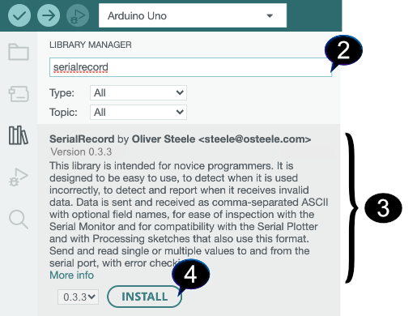

# Serial Record Library for Arduino

[](https://github.com/osteele/Arduino_SerialRecord/actions/workflows/arduino-lint.yml)
[](https://github.com/osteele/Arduino_SerialRecord/actions/workflows/compile-examples.yml)

The [SerialRecord library for
Arduino](https://osteele.github.io/Arduino_SerialRecord/) sends and receive
*records, containing multiple* integers, over the serial port.

This library is intended for novice programmers. It is designed to be easy to
use, to detect when it is used incorrectly, to detect and report when it
receives invalid data. Data is sent in a format that is compatible with the
Serial Montior and Serial Plotter tools: comma-separated ASCII values, with
optional field names.

The library can be used with the [SerialRecord library for
Processing](https://osteele.github.io/Processing_SerialRecord/), but does not
require it.


[SerialRecord library for Processing]: https://osteele.github.io/Processing_SerialRecord/

## Design Goals

- Easy for novice programmers to configure and use
- Easy to inspect the transmitted data
- Detects and provides diagnostics for common errors

### Non-goals

- Efficiency. The library uses an ASCII representation of numbers. This is easy
  to visually inspect without tools, but it is computationally expensive to read
  and write, and requires more bandwidth than a binary representation.
- Flexibility. All records must have the same number of values; only integers
  are supported. These limitations make it possible to detect errors in code
  that uses the library, but they are not appropriate for all projects. (See the
  "Alternatives" section below.)

## Features

- Send an "!e" to the sketch to send received the values array back to the
  serial port. (The "SerialRecord for Processing" library can be set to do this
  periodically.)
- Attempting to read an array position that is out of bounds prints an error to
  the serial port, and returns the value -1.
- If a record contains too many values or too few, the library prints an error
  to the serial port. (The matching "SerialRecord for Processing" library can be
  set to automatically display this error, and other errors, to the Processing
  console and optionally on the canvas.)
- If a received line cannot be parsed as a series of integers, the library
  prints a warning is printed on the serial port.

## Installation

1. In the Arduino IDE, select the *Tools > Manager Libraries* menu item. This
   opens a new pane, "Library Manager", on the left side of the current editor
   window.
2. In the Library Manager pane, there is a text area with a prompt "Filter your
   search". Enter "serialrecord" into this text field.
3. There should be one search result, "SerialRecord by Oliver Steele". Move the
   mouse over this search result, in order to disclose the "Install" button as
   shown in the screenshot.
4. Click "Install".



## Examples

Once this library has been installed, the following examples are available in
the *File > Examples > SerialRecord* submenu. You can also [view the examples n
GitHub](https://github.com/osteele/Arduino_SerialRecord/tree/main/examples).


The examples are designed to interoperate with Processing sketches, in the
[SerialRecord library for Processing] library. The [SerialRecord for Processing
wiki](https://github.com/osteele/Processing_SerialRecord/wiki/Examples) suggests
which example from the [SerialRecord library for Processing] library is intended
for use with each Arduino example. (For example, the Arduino
`ReceiveSingleValue` sketch was designed to pair with the Processing
`SendSingleValue` sketch.)

> Note: The examples that send values contain a call to `delay(20)`. This
> prevents the Arduino from *sending* data faster than a Processing sketch that
> is running at the default 30 frames per second can *process* it. There are
> other ways to prevent this problem from occurring, but this is the simplest.

> Note: Due to a bug in the Arduino IDE 2.0.0 as of October 2022, library
> examples may not appear in the Examples menu, the first time you select the
> *File &gt; Examples* menu item. If the only examples listed are the "Built-in
> examples", simply release the mouse button and then select the *File &gt;
> Examples* menu item a second time, in order to see library examples as well.

### SendSingleValue

This sketch repeatedly sends a record that contains a single value.

The sketch pairs well with the ReceiveSingleValue example from the [SerialRecord
library for Processing].

You can also use the Serial Monitor to inspect the values that the sketch sends
to the serial port.

This sketch has the same effect as calling `Serial.println(value)`. Its
advantage is that it is simple to modify it to log a second value, in a format
that the receiving program can reliably distinguish the first from the second
value. (The SendMultipleValues example demonstrates this.)

Things to try:

- Connect a potentiometer to the Arduino, and send its value instead.

### SendMultipleValues

This sketch repeatedly sends a record that contains two values:

1. The value of `millis()`, modulo 1024.
2. The analog value that is read from pin 0. If you attach a potentiometer to
  that pin, you can control this value by moving the pot.

This sketch pairs well with the RecieveMultipleValues example from the
[SerialRecord library for Processing].

You can also use the Serial Monitor to inspect the values that the sketch sends
to the serial port.

Things to try:

- Connect a second potentiometer to the Arduino, and send the values from both
  potentiometers instead of sending a value that is based on `millis()`.
- Send the value from another sensor, such as temperature or proximity.

### ReceiveSingleValue

This sketch repeatedly receives a record that contains a single value, and uses
it to control the builtin LED. The value should be 0 or 1.

This sketch pairs well with the SendSingleValue example from the [SerialRecord
library for Processing].

You can also interact with this sketch from the Serial Monitor. Enter `0` or `1`
into the text area at the top, and press "Send". Then enter `!e` to ask the
Arduino to send back the last values it received.

### ReceiveMultipleValues

This sketch repeatedly receives a record that contains two values. Both values
should be in the range 0…1023:

- The first value controls the builtin LED. The LED is turned on if the value is
  in the upper half of the range (512…1023).
- The second value controls a buzzer attached to pin 9. If the value is 0, the
  buzzer is silenced; otherwise, it plays a tone at the specified frequency.

This sketch pairs well with the SendMultipleValues example from the
[SerialRecord library for Processing].

You can also interact with this sketch from the Serial Monitor. Enter `100,200`
into the text area at the top, and press "Send". Then enter `!e` to ask the
Arduino to send back the last values it received.

### SendReceiveMultipleValues

This sketch repeatedly receives two values, and send back the same values in the
opposite order as well as their sum.

(This mode of communication, where the same connection is used both to send and
receive data, is called "full duplex".)

This sketch pairs well with the SendReceiveMultipleValues example from the
[SerialRecord library for Processing] library.

You can also interact with this sketch from the Serial Monitor. Enter `100,200`
into the text area at the top, and press "Send".

### SendFieldNames

This sketch is similar to SendMultipleValues, except that it also includes field
names in the strings that it sends. These field names are displayed in the
Serial Monitor and the Serial Console. The [SerialRecord library for Processing]
library stores them in a separate array, so that a program that uses that
library can either process or ignore them.

Example output:

```text
millis:12,analog:113
millis:24,analog: 115
```

## Motivation

This library was intended as a replacement for the manual use of seqeunces of
code such as:

```c++
Serial.print(value1);
Serial.print(",");
Serial.print(value2);
Serial.print(",");
Serial.print(value3);
Serial.println();
```

While teaching an introductory course on physical computing, I found that novice
programmers often end up with code that fails to separate values by the
separator character "`,`", omits the final `Serial.println()`, and/or places
this `Serial.println()` between values within the record. This resulted in
mysterious (to the students) failure modes. Debugging the resulting errors did
not contribute to the learning objectives for this particular course.

## Alternatives

For sending values, the simplest alternative is just to use `Serial.println()`.

For alternatives that support a variety of transports and serialization formats
(including higher-efficiency binary formats), browse the Communications topic of
the Arduino library manager.

In particular, note:

- [Firmata](https://github.com/firmata/arduino), which features declarative
  binding of value positions to sensors or pin numbers.
- [VSync Library](http://ernestum.github.io/VSync/) for the Arduino platform
  "magically" synchronizes Arduino and Processing variables.

## Acknowledgements

The idea of providing this code as a library was inspired by code provided to
students by the NYU Shanghai IMA "Interaction Lab" course, for them to copy and
paste into their sketches.

## License

Copyright (C) 2020-2022 Oliver Steele. This software is made available under the
terms of the GNU LGPL License.
